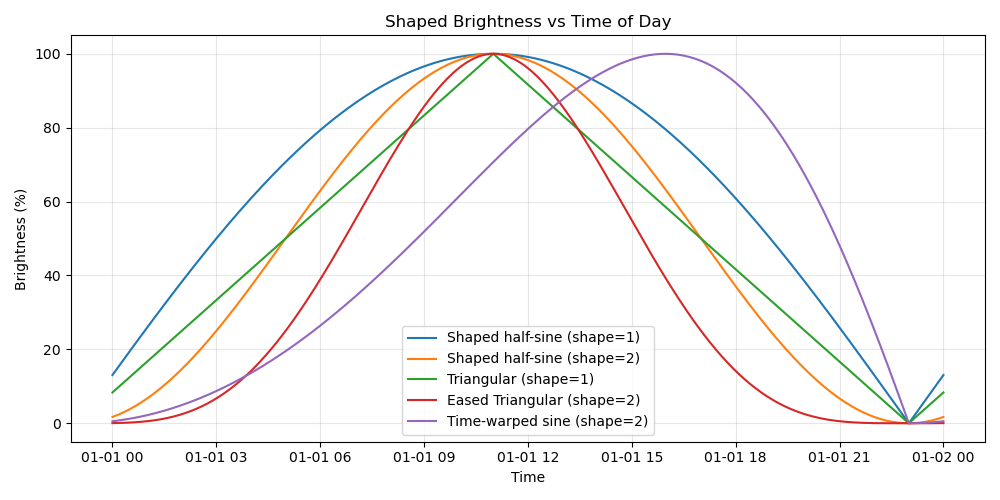
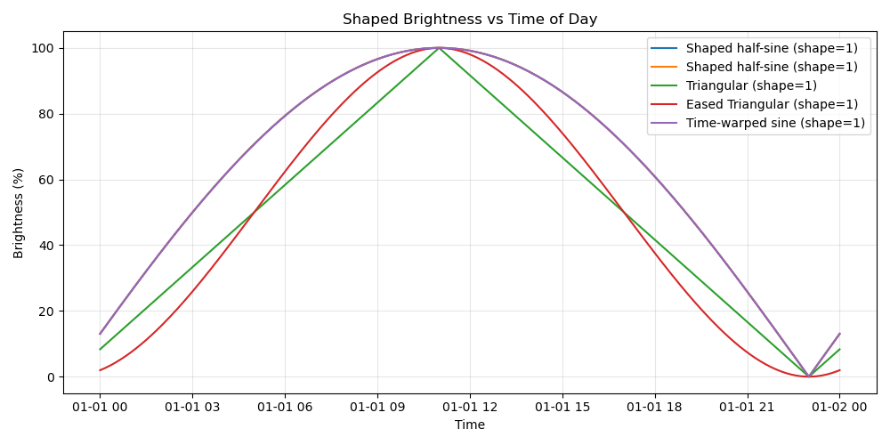
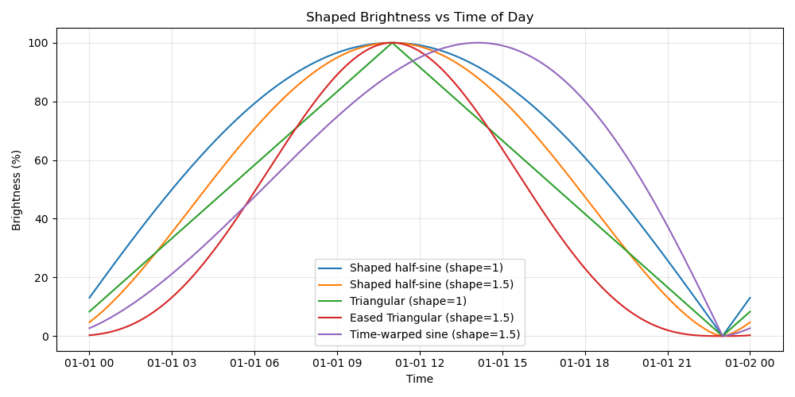

# Periodic Lights  
*A Home Assistant integration for adaptive, solar-synchronized lighting*

Periodic Lights is a custom Home Assistant integration that automatically adjusts the brightness and color temperature of selected lights throughout the day using a continuous 24-hour periodic curve.  

It includes:

- Area awareness
- Automatic brightness & color-temperature shaping  
- Multiple curve shaping functions  
- Bedtime mode  
- Per-light custom brightness/CT ranges  
- Transition control  
- Responsive updates when lights turn on  

All configuration is available through the Home Assistant UI. No YAML or file editing required.

---

## Table of Contents

1. [Features](#features)  
2. [Installation](#installation)  
3. [How It Works](#how-it-works)  
4. [Configuration](#configuration)  
5. [Entities Created](#entities-created)  
6. [Shaping Functions](#shaping-functions)  
7. [Planned Extensions](#planned-extensions)

---

# Features

- Area-based and/or individual light selection
- 24-hour continuous brightness & color temperature curve  
- Multiple selectable curve shaping functions  
- Adjustable shaping parameter  
- Bedtime mode   
- Per-light override ranges  
- Respect lights that are off (never forcibly turns on a light)  
- Update lights when turned on (optional)  
- Smooth transitions  
- Full restart-persistence using RestoreEntity  

---

# Installation

1. Copy the folder:

```
custom_components/periodic_lights/
```


into your Home Assistant `config/custom_components` directory.

2. Restart Home Assistant.

3. Go to  
**Settings → Devices & Services → Add Integration → Periodic Lights**

4. The UI setup flow guides you the rest of the way.

After setup, additional controls become available as switches, number inputs, and selects.

---

# How It Works

Periodic Lights computes a **curve** based on your Home Assistant location:

- **Solar midday**: halfway between sunrise and sunset → **peak brightness**  
- **Solar midnight**: halfway between sunset and sunrise → **minimum brightness**  

From this baseline curve, a **shaping function** transforms the percentage to produce different styles.

Brightness and color temperature are then mapped from this shaped percentage into your configured min/max ranges.

Lights that are on are continuously updated based on:

- The curve  
- Shaping function  
- Bedtime mode  
- Per-light override sliders  
- Transition time  
- Update interval  
- “Transition on turn-on” switch  

Lights that are **off are never turned on** by this integration. If you adjust the light's brightness or temperature outside of this integration it will stop updating the light until the light is synced with the button, or the light is toggled off -> on. 

---

# Configuration

All parameters are accessible through the built-in config flow and the entities created under your device.

### **Initial Setup Flow Options**

| Parameter | Description |
|----------|-------------|
| **Setup Name** | A friendly name for the lighting setup. |
| **Choose Area (optional)** | Allows selecting an HA Area; lights in that area are automatically added. Note, this only happens once upon configuration. To update area lights you can reconfigure the device after the fact. |
| **Use Hidden Lights in Configured Area** | Includes hidden light entities in the area scan. |
| **Choose Lights (optional)** | Manually select individual lights. |
| **Minimum Brightness (%)** | Lowest brightness curve value. |
| **Maximum Brightness (%)** | Highest brightness curve value. |
| **Minimum Color Temperature (K)** | Warmest kelvin. |
| **Maximum Color Temperature (K)** | Coolest kelvin. |
| **Update Interval (s)** | How often to push updates to lights. |
| **Transition Time (s)** | How long lights fade when updated. |

---

### **Post-Setup Controls (Entities)**

When setup completes, you get multiple controls grouped under one device:

#### **Switches**
| Entity | Function |
|--------|----------|
| **Enabled** | Master enable/disable for the entire setup. |
| **Brightness Updates** | Toggles brightness control. |
| **Color Temperature Updates** | Toggles CT control. |
| **Bedtime** | When on, forces all lights to minimum brightness & CT. |
| **Transition When Light Turns On** | If enabled, newly turned-on lights immediately transition to current curve values. |
| **Use Fixed Minimum Time** | If enabled, uses the time set in the Fixed Minimum Time entity to set a fixed minimum point. Using this feature disables solar based curve calculation so the light parameters will not vary with the season.

#### **Number Inputs**
These are editable anytime:

| Entity | Purpose |
|--------|---------|
| Min/Max Brightness | Global brightness range. |
| Min/Max Color Temp | Global kelvin range. |
| Update Interval | Adjust how often lights update. |
| Transition Time | Set fade time when applying changes. |
| Shaping Parameter | Parameter controlling the shaping function behavior. |

Each configured light also gets **per-light**:
- Min Brightness  
- Max Brightness  
- Min Kelvin  
- Max Kelvin  

These start disabled but can be enabled via Entity Registry.

#### **Select**
| Entity | Options |
|--------|---------|
| **Shaping Function** | Gamma Sine, Time-Warped Sine, Triangular, Eased Triangular |

---

# Shaping Functions

Below are the shaping functions available to the user. The shape parameter can be changed by the number input described above. 



---

## **1. Gamma Sine (default)**
**Formula:**  
`sin(x) ^ γ`, normalized to 0–1  
- γ = 1 → standard half-sine (baseline reference)  
- γ > 1 → sharper midday peak, flatter edges  
- γ < 1 → smoother rise and fall  

**Best for:** natural, smooth circadian behavior.

---

## **2. Time-Warped Sine**
Applies a nonlinear “speeding up / slowing down” of time before applying a sine curve.

Produces a curve that:
- Rises more slowly in the morning  
- Peaks later than other curves
- Rapid slope towards minimum time

**Best for:** dim morning behavior with plenty of light in the evening. Great for kitchens.

---

## **3. Triangular (Linear)**
A straight linear rise from minimum to maximum, then linear fall back down. This is not shaped by the shaping variable. 

**Best for:**  
- Maximum predictability  

---

## **4. Eased Triangular**
A triangular linear shape, but corners softened with an S-curve easing.

**Best for:**  
- Linear-like behavior  
- But smoother, less abrupt transitions  

---

## Various shaping parameter settings

Shaping parameter 1:



Shaping parameter 1.5:



Shaping parameter 2:


<!-- # Planned Features

- Manual override “cooldown period”   -->

---

## Daily curve preview

Each setup provides a **Daily curve preview** image entity. In a dashboard, add a
**Picture Entity** card and select this entity, or adapt this example to its actual ID:

```yaml
type: picture-entity
entity: image.living_room_daily_curve_preview
show_name: true
show_state: false
```

The PNG shows the configured setup-wide brightness and temperature schedule for the
local calendar day, with a current-time line and sampled minimum/maximum markers.
Settings changes invalidate the image immediately; the current-time marker refreshes
every five minutes. Rendering is cached and runs outside the event loop.
Bedtime and disabled-control annotations explain why live behavior may differ.
Per-light ranges, manual overrides, and light on/off state are not forecasts in this
setup-wide graph. Daylight-saving days contain 23 or 25 actual hours where applicable.
The image has no hover tooltips and requires no custom dashboard resource.

Validation: run `python -m unittest discover -s tests -p "test_runtime*.py"`.
These unit tests mock the Home Assistant boundary; a live Home Assistant smoke test
is still recommended before deployment.
