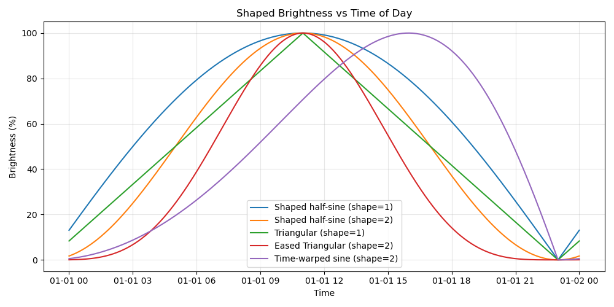

# Periodic Lights

*Adaptive, solar-synchronized lighting for Home Assistant.*

Periodic Lights automatically adjusts the brightness and color temperature of your
lights throughout the day. Configure everything through the Home Assistant UI—no
YAML or file editing required for setup.

## Features

- Select lights individually or by area.
- Choose from four curve shapes, with adjustable brightness and temperature ranges.
- Use solar timing or a fixed minimum time, with optional separate temperature shaping.
- Set per-light ranges, smooth transitions, and bedtime mode.
- Preview the daily curve and check each light’s adaptation status.

## Installation

1. Copy `custom_components/periodic_lights/` into your Home Assistant
   `config/custom_components/` directory.
2. Restart Home Assistant.
3. Open **Settings → Devices & Services → Add Integration → Periodic Lights**.
4. Choose your lights or area and set the brightness and temperature ranges.

After setup, open the integration’s device page to adjust its controls.
See the [configuration reference](docs.md#configuration) for individual options.

## How it works

A daily curve maps the time of day to your configured brightness and color
temperature ranges. Solar timing places the baseline peak around solar midday and
the minimum around solar midnight; shaping controls change how the curve rises
and falls.

Periodic Lights updates lights that are already on. If you adjust a light manually,
adaptation pauses for that light until you use **Clear overrides and update** or
turn the light off and back on.

## Curve shapes

Choose **Gamma Sine**, **Time-Warped Sine**, **Triangular**, or **Eased Triangular**
to suit your routine. Adjust the shaping parameter to tune the curve.

See [shaping functions and examples](docs.md#shaping-functions) for the differences.

For detailed controls, diagnostics, and update behavior, see the
[full documentation](docs.md).

## AI use

AI was used to translate the previous AppDaemon app to a custom component. AI was also used to extend the component to include several new features.