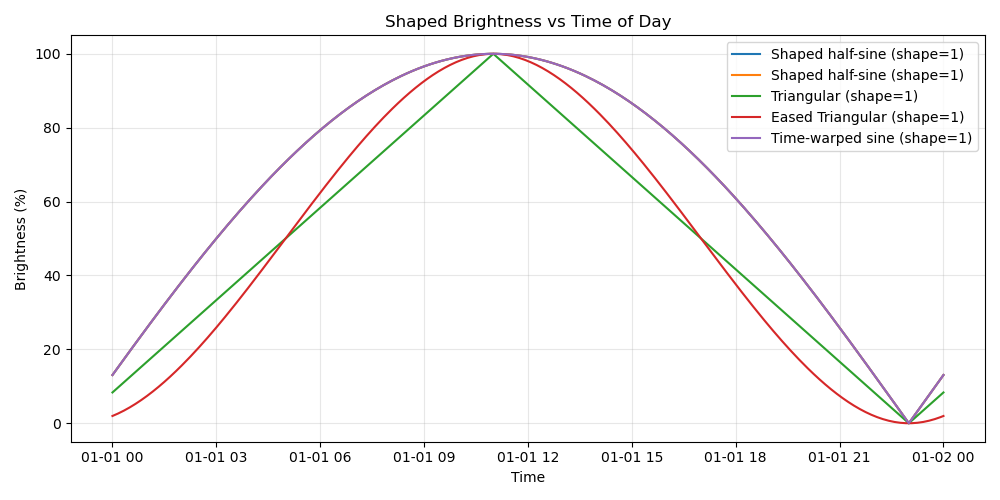
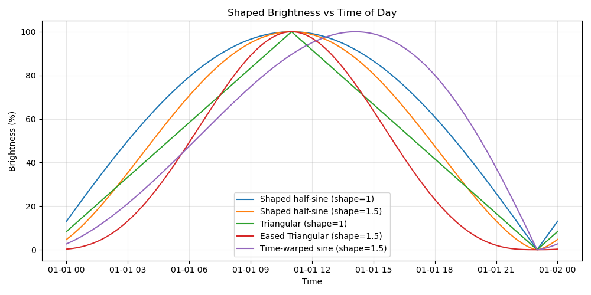

# Periodic Lights documentation

[Back to the overview and installation guide](README.md)

- [Configuration](#configuration)
- [Shaping functions](#shaping-functions)
- [Daily curve preview](#daily-curve-preview)
- [Per-light adaptation diagnostics](#per-light-adaptation-diagnostics)
- [Separate temperature curve](#separate-temperature-curve)
- [Avoiding redundant light commands](#avoiding-redundant-light-commands)
- [Development](#development)

## Configuration

All parameters are accessible through the built-in config flow and the entities created under your device.

### Initial setup options

| Parameter | Description |
|----------|-------------|
| **Setup Name** | A friendly name for the lighting setup. |
| **Choose Area (optional)** | Allows selecting an HA Area; lights in that area are automatically added. Note, this only happens once upon configuration. To update area lights you can reconfigure the device after the fact. |
| **Use Hidden Lights in Configured Area** | Includes hidden light entities in the area scan. |
| **Choose Lights (optional)** | Manually select individual lights. |
| **Minimum Brightness (%)** | Lowest brightness curve value. |
| **Maximum Brightness (%)** | Highest brightness curve value. |
| **Minimum Color Temperature (K)** | Warmest kelvin. |
| **Maximum Color Temperature (K)** | Coolest kelvin. |
| **Update Interval (s)** | How often to push updates to lights. |
| **Transition Time (s)** | How long lights fade when updated. |

### Controls and entities

When setup completes, you get multiple controls grouped under one device:

#### Switches

| Entity | Function |
|--------|----------|
| **Enabled** | Master enable/disable for the entire setup. |
| **Brightness Updates** | Toggles brightness control. |
| **Color Temperature Updates** | Toggles CT control. |
| **Bedtime** | When on, forces all lights to minimum brightness & CT. |
| **Transition When Light Turns On** | If enabled, newly turned-on lights immediately transition to current curve values. |
| **Use Fixed Minimum Time** | If enabled, uses the time set in the Fixed Minimum Time entity to set a fixed minimum point. Using this feature disables solar based curve calculation so the light parameters will not vary with the season. |

#### Number inputs

These are editable anytime:

| Entity | Purpose |
|--------|---------|
| Min/Max Brightness | Global brightness range. |
| Min/Max Color Temp | Global kelvin range. |
| Update Interval | Adjust how often lights update. |
| Transition Time | Set fade time when applying changes. |
| Shaping Parameter | Parameter controlling the shaping function behavior. |

Each configured light also gets **per-light**:

- Min Brightness
- Max Brightness
- Min Kelvin
- Max Kelvin

These start disabled but can be enabled via Entity Registry.

#### Shaping function select

| Entity | Options |
|--------|---------|
| **Shaping Function** | Gamma Sine, Time-Warped Sine, Triangular, Eased Triangular |

## Shaping functions

Below are the shaping functions available to the user. The shape parameter can be changed by the number input in the setup’s controls.


### Gamma Sine (default)

**Formula:** `sin(x) ^ γ`, normalized to 0–1.

- γ = 1 → standard half-sine (baseline reference)
- γ > 1 → sharper midday peak, flatter edges
- γ < 1 → smoother rise and fall

**Best for:** natural, smooth circadian behavior.

### Time-Warped Sine

Applies a nonlinear “speeding up / slowing down” of time before applying a sine curve.

Produces a curve that:

- Rises more slowly in the morning
- Peaks later than other curves
- Rapid slope towards minimum time

**Best for:** dim morning behavior with plenty of light in the evening. Great for kitchens.

### Triangular (Linear)

A straight linear rise from minimum to maximum, then linear fall back down. This is not shaped by the shaping variable.

**Best for:**

- Maximum predictability

### Eased Triangular

A triangular linear shape, but corners softened with an S-curve easing.

**Best for:**

- Linear-like behavior
- But smoother, less abrupt transitions

### Shaping parameter examples

Shaping parameter 1:



Shaping parameter 1.5:



Shaping parameter 2:


## Daily curve preview

Each setup provides a **Daily curve preview** image entity. In a dashboard, add a
**Picture Entity** card and select this entity, or adapt this example to its actual ID:

```yaml
type: picture-entity
entity: image.living_room_daily_curve_preview
show_name: true
show_state: false
```

The PNG shows the configured setup-wide brightness and temperature schedule for the
local calendar day, with a current-time line and sampled minimum/maximum markers.
Settings changes invalidate the image immediately; the current-time marker refreshes
every five minutes. Rendering is cached and runs outside the event loop.
Bedtime and disabled-control annotations explain why live behavior may differ.
Per-light ranges, manual overrides, and light on/off state are not forecasts in this
setup-wide graph. Daylight-saving days contain 23 or 25 actual hours where applicable.
The image has no hover tooltips and requires no custom dashboard resource.

## Per-light adaptation diagnostics

Each configured light has an **Adaptation** diagnostic sensor on the setup's device page.
Its state explains whether the light is adapting, off, unavailable, manually overridden,
or blocked by the master or control switches. If several conditions apply, unavailable
and off take precedence, followed by master disable, controls disable, and manual override.
The more-info attributes include rounded per-light targets, enabled controls, and the last
command-sent timestamp. A sent command is not confirmation that a bulb applied it.
Targets describe the configured output even while a light is off or overridden.
No per-light resume button or pause controls are added.

## Separate temperature curve

The **Use separate temperature curve** switch defaults off. With it off, the existing
shaping and timing controls continue to govern both brightness and temperature.
Turn it on to use the new **Temperature Shaping Function**, **Temperature Shaping
Parameter**, **Temperature Use Fixed Minimum Time**, and **Temperature Fixed Minimum
Time** controls for temperature only. The original controls then govern brightness.
On first enable, temperature settings copy the shared curve unless you have already
edited a temperature control. Later toggles retain your temperature settings.
The controls stay visible while linked; their attributes show whether they apply.
All five controls restore across restarts. Bedtime still uses the configured minimums,
and global and per-light brightness/Kelvin ranges continue to set output limits.
Place the existing controls and temperature controls in separate Entities cards to
make a Brightness Curve / Temperature Curve dashboard layout.

The daily curve preview applies these temperature settings to its temperature plot.

## Avoiding redundant light commands

Periodic updates compare each light's rounded brightness and Kelvin targets with its
last successfully sent values. Unchanged channels are omitted; if neither channel
changed, no command is sent. Split updates also skip unchanged channels and do not
wait for a brightness transition when only temperature needs updating.

Forced updates (including the clear-overrides button) still resend current targets.
The cache is runtime-only and is cleared by the existing off/on, unavailable,
disable, and clear-overrides handling. Failed service calls are retried on a later
update. Successful service execution does not guarantee a physical bulb applied it;
a forced update can resynchronize it. Turn-off commands retain their existing behavior.
Skipped updates do not advance the diagnostic last-command timestamp or extend the
manual-override detection window.

## Development

Run the runtime unit tests:

```bash
python -m unittest discover -s tests -p "test_runtime*.py"
```

These tests mock the Home Assistant boundary. Use a live Home Assistant installation
to verify behavior before deployment.
